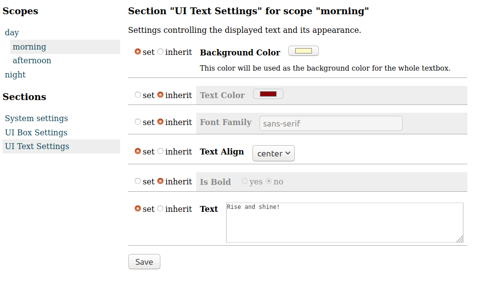

Tzunghaor Settings Bundle
========================= 



With this bundle you can define your settings as php classes. The settings
will be stored in database - this is somewhat similar how you would define 
doctrine entities, but in this case all settings are stored in a single table, 
and if you don't have record for a setting in database, it will use the 
default value in your php class.

In this bundle you get a controller to edit your settings, and a service that
returns the current settings as an object. You can use symfony dependency 
injection to inject such setting objects as services. (See examples in the
Setup section below).

Furthermore you can define scopes (as a hierarchy tree): each setting can
have different values in different scopes or inherit the setting value
from the parent scope.


Installation
============

Make sure Composer is installed globally, as explained in the
[installation chapter](https://getcomposer.org/doc/00-intro.md)
of the Composer documentation.

Applications that use Symfony Flex
----------------------------------

Open a command console, enter your project directory and execute:

```console
$ composer require tzunghaor/settings-bundle
```

Applications that don't use Symfony Flex
----------------------------------------

### Step 1: Download the Bundle

Open a command console, enter your project directory and execute the
following command to download the latest stable version of this bundle:

```console
$ composer require tzunghaor/settings-bundle
```

### Step 2: Enable the Bundle

Then, enable the bundle by adding it to the list of registered bundles
in the `config/bundles.php` file of your project:

```php
// config/bundles.php

return [
    // ...
    Tzunghaor\SettingsBundle\TzunghaorSettingsBundle::class => ['all' => true],
];
```

Additional recommended packages
-------------------------------

* **phpdocumentor/reflection-docblock** - with this installed, you have more
    possibilities to define your settings  
* **symfony/asset** - the setting editor twig template uses asset() - if you
    don't have it installed, then you have to override __editor_page.html.twig__
* **symfony/validator** - with this you can define validation rules on your
    setting classes that will be used in the setting editor. 
    See [symfony validation](https://symfony.com/doc/current/validation.html).
    

Setup
=====

Database Setup
--------------

You need a database table to store your settings - the easiest way is to
use the entity definition provided by this bundle. If you have auto mapping
enabled in doctrine, then you can skip this configuration step.

```yaml
#config/packages/doctrine.yaml
doctrine:
  orm:
    auto_mapping: false
    mappings:
      Tzunghaor\SettingsBundle:
        type: annotation
          dir: '%kernel.project_dir%/vendor/tzunghaor/settings-bundle/Entity'
          prefix: 'Tzunghaor\SettingsBundle\Entity'
``` 

Create Table
------------

To actually create the table, use preferably doctrine migrations:

```sh
$ bin/console doctrine:migrations:diff
$ bin/console doctrine:migrations:migrate
```

or the fast and dangerous way on your developer machine:

```sh
$ bin/console doctrine:schema:update --force
```

[More about the database table](Resources/doc/database.md)

Defining Setting Classes
------------------------

You can define your settings in php classes (I will call such classes as 
setting sections, or simply as sections), for example create a directory
for your settings (e.g. src/Settings), and create a BoxSettings.php in it:

```php
// src/Settings/BoxSettings.php
namespace App\Settings;
use Tzunghaor\SettingsBundle\Annotation\Setting;

class BoxSettings
{
    /**
     * @var int
     */
    public $padding = 0;

    /**
     * @var string[]
     * @Setting(enum={"bottom", "top", "left", "right"})
     */
    public $borders = [];
}
```

Since at the beginning no settings are stored in the database, it is best to set
sensible default values in your class.

[More about setting classes](Resources/doc/define_section.md)

Then tag your file with `tzunghaor_settings.setting_section`

```yaml
# services.yaml
services:
  App\Settings\BoxSettings:
    tags:
      - 'tzunghaor_settings.setting_section'
```

Then you can get your settings either directly via dependency injection:

```php
use App\Settings\BoxSettings;

class MyService
{
    // ...
    
    public function __construct(BoxSettings $boxSettings)
    {
        $doublePadding = $boxSettings->padding * 2; 
```

Or you can get your settings from the service provided by the bundle. This
will be especially useful if you define multiple scopes (see below).

```php
use App\Settings\BoxSettings;
use Tzunghaor\SettingsBundle\Service\SettingsService;

class MyService
{
    // ...
    
    public function __construct(SettingsService $settingsService)
    {
        /** 
         * declaring variable type for auto-complete support in IDE
         * @var BoxSettings $boxSettings 
         */
        $boxSettings = $settingsService->getSection(BoxSettings::class);
        $doublePadding = $boxSettings->padding * 2; 
```

Setting up the editor
---------------------

> If you have **symfony/asset** installed then you can skip to setting up the route.
Otherwise you first have to 
overwrite a twig template: create a new directory in your application 
**templates/bundles/TzunghaorSettingsBundle**,
copy **Resources/views/editor_page.html.twig** to there, and modify the copy to
load the required .js and .css without the `asset()` twig function.

Add the route defined by the bundle to your routes:

```yaml
# config/routes.yaml

tzunghaor_settings_editor:
  resource: '@TzunghaorSettingsBundle/Resources/config/routes.xml'
  prefix: '/settings_edit'
```

Then go to `https://your.domain/settings_edit/` in your browser.

You probably want to set up some firewall rules in your security config for
this controller.

Setting up cache
----------------

It is strongly advised to use a cache with this bundle, e.g.:

```yaml
# config/packages/tzunghaor_settings.yaml

tzunghaor_settings:
  cache: 'cache.app'
```

Currently you need to clear the cache every time you do changes in your 
setting section classes.

Advanced Usage
==============

Using scopes
------------

If you need different values for the same setting in different scenarios,
then you can use scopes:

```yaml
# config/packages/tzunghaor_settings.yaml

tzunghaor_settings:
  # tag aware cache needed when using nested scopes
  cache: 'cache.app.taggable'
  default_scope: day
  scopes:
    - name: day
      children:
        - name: morning
        - name: afternoon
    - name: night
```

The scope names are used in different contexts, therefore it's best to use only
alphanumeric characters and underscores.

You can build arbitrary deep hierarchies (child nodes can have children, etc.), 
but if you use nested scopes (meaning you have at least one "children" node)
you will need a tag aware cache, 
see **Symfony\Contracts\Cache\TagAwareCacheInterface**.

The bundle will use **default_scope** for creating dependency injected 
setting sections. It can be useful to have your webserver to set an 
environment variable based on the request, and use that in your config.

For non-default scope settings you will need the SettingsService:

```php
    public function __construct(SettingsService $settingsService)
    {
        $boxSettings = $settingsService->getSection(BoxSettings::class, 'night');
        $doublePadding = $boxSettings->padding * 2; 
```  
